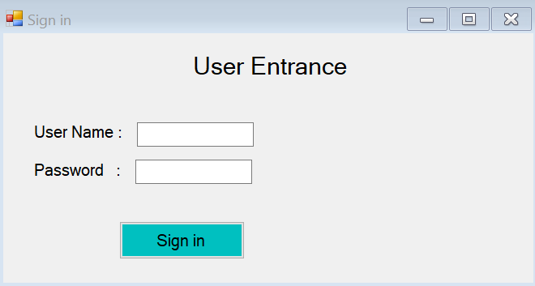
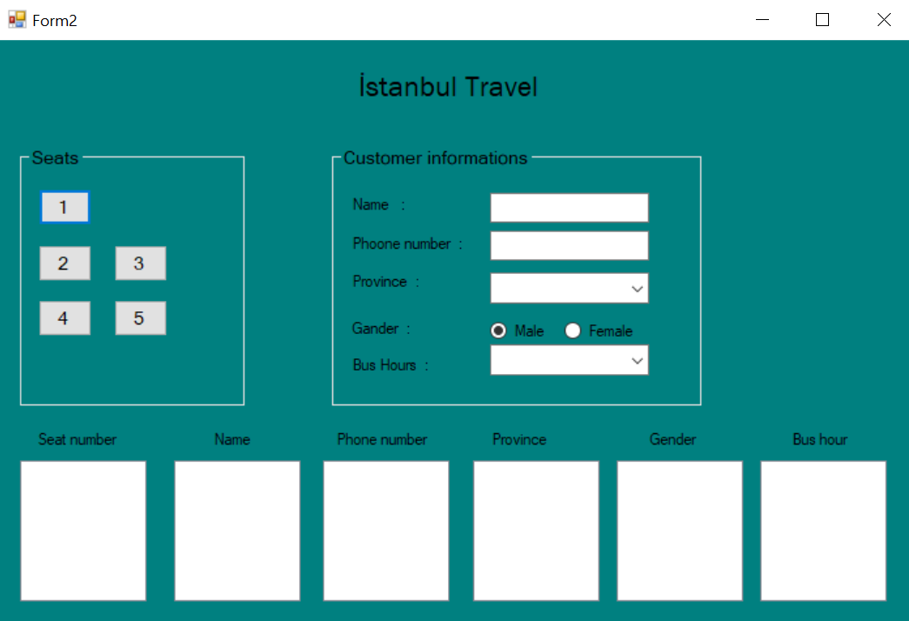

# BusTravel
A simple bus/travel program created with  C#. Thanks to Murat Yücedağ. It is an exapmle in his youtube channel. I added some extra futures.
There is a login screen.

In second form there are five seats. When the button click first it checks if informations which must be filled are emtpy then those infomations are written to listboxes.

